# README

This framework supports multi-agent simulation in MATLAB using object-oriented fashion. This framework is now under conversion to C/C++ implementation for higher performance. Currently, agent adopts the basic collision avoidance maneuvers and cooperative algorithms. The framework also implements a CoppeliaSim remote API wrapper for simulation using physical engine.

Author:  [Lu, Hong](http://www.lewissoft.com)

For questions regarding the project, drop me lines by email at: luhong@westlake.edu or luh.lewis@gmail.com.


## Table of Contents

- [Structure](#structure)
  - [Map Initialization](#Map-Initialization)
  - [Outlier APIs wrapper](#Outlier-APIs-wrapper)
- [Class](#class)
  - [Agent](#Agent)
  - [Obstacle](#Obstacle)
  - [Random Searcher](#Random-Searcher)
  - [Vrep](#Vrep)
- [Slices](#Slices)
- [License](#license)
- [Reference](#reference)


## Structure

<div align="center">
    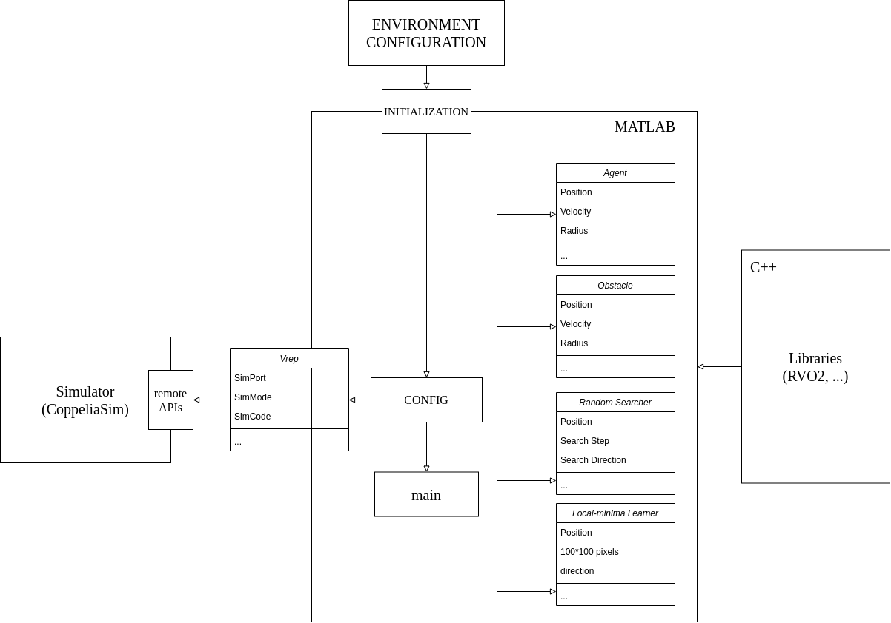
    <p>
        General structure of the simulator
    </p>
</div>


- Vertically, the simulator configuration is initialized by maps outside according to certain predefined regulation. Map initialization has been shown in [Map Initialization](#map-initialization).
- Horizontally, the framework has various types of plug-in usages through MATLAB tools. Framework can use .MEX files to load RVO2 library for some certain purposes. CoppeliaSim Simulator remote-API has also been wrapped.

### Map Initialization

<div align=center>
    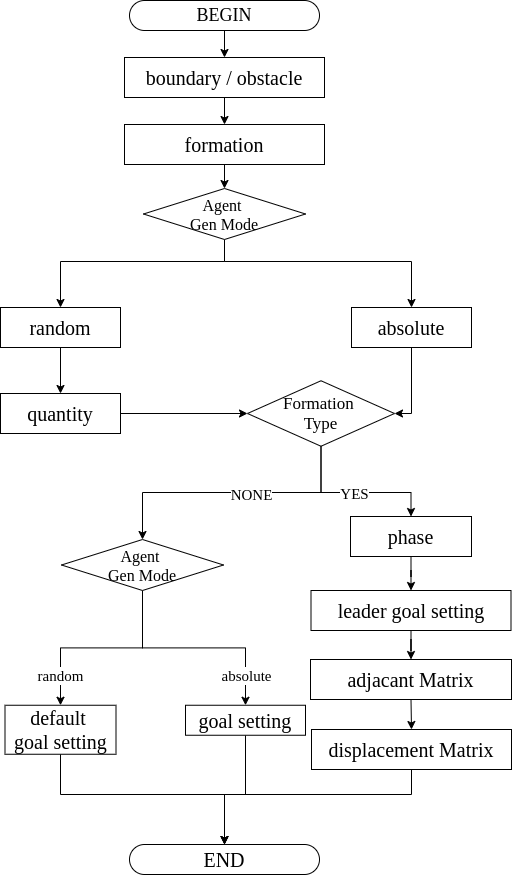
    <p>Map initialization process in "util/loadMap.m"</p>
</div>


There are several self-defined keywords for map configuration:

* boundary
* deltaT
* formation (this is calculated in the **helperCalPrefVelocity** function of Agent.m)
  * none
  * displacement
    * displacementMatrix
  * **ADDABLE** (e.g. position, distance)
* mode
  * absolute
  * random
    * quantity
* agent
* goal
* phase
* adjacantMatrix

All these keywords are parsing in "util/loadMap.m" and are members in **CONFIG** structure for simulation in MATLAB.

#### Map Example

See "maps/example_absolute.txt", "maps/example_absolute_formation.txt", "maps/example_random.txt"

### Outlier APIs wrapper (Horizontal extension)

#### Use  RVO2 Library

MEX is implemented for using RVO2 library written by [UNC](gamma.cs.unc.edu/RVO2/), detailed description is illustrated in *"doc/mex.pdf"* and *"doc/MATLAB_Cplusplus.md"*. Code is at *"RVO2/rvoGen"* folder which includes MEX generation script and CPP file for using RVO2 lib through MEX interface.

<div style="text-align:center">
    
    <p>
        Circle senario using RVO2 C++ LIB through MEX, shown in MATLAB
    </p>
</div>


To use RVO2 library, you should figure out the parameters' meanings. 

For example,

```C
sim->setAgentDefaults(f,i,f,f,f,f);
```

regulates the agent's behavior like maximum numbers of neighbors and maximum velocity, etc. which can been seen in **RVO2 documents**.

#### CoppeliaSim (V-rep) simulator

CoppeliaSim remote API is used in *"@Vrep"* folder. It is a custom wrapper for our simulation of differential drive robot. Current functions can be seen in [here](#Vrep).

<div>
    <video src="src/video/noObsVrep.mp4"></video>
    <p style="text-align:center">
        CoppeliaSim
    </p>
</div>


<div>
    <video src="src/video/threeObsVrep.mp4"></video>
	<p style="text-align:center">
        Simulation of [2] in CoppeliaSim
    </p>
</div>

How to do so, please check at **CoppeliaSim Helper File Website**.


## Classes

### Agent

* Public
  * calNN
    * calculate the neighbors, including other agents and obstacles based on processed perception information.
  * calOptVel
    * based on current state and preference velocity of the agent, this function calculates the optimal velocity under certain constraints.
  * calVO
    * calculate the velocity obstacle for each neighbor based on pre-calculated CC. (a public one)
  * isReachGoal
    * function judges if agent reaches the goal.
* Private (helper functions)
  * helperBuildSearchTree
    * search tree builder (e.g. RRT object), having member function search() for exploring the available configuration.
  * helperCalCollisionCone
    * calculate the collision cone which apex is the velocity space origin of agent itself.
  * helperCalVelocityObstacle
    * calculate the velocity obstacle based on calculated collision cone.
  * helperCalVelocityMap
    * calculate the reachable velocity map for agent itself under it's certain kinematic constraint.
  * helperCalPrefVelocity
    * calculate the preference velocity of the agent itself. Normally, it is generated by the vector pointing to the goal with magnitude with maximum velocity. In the formation, it is also constrained by the formation control law.
    * At the end, a disturbance is added to the velocity for breaking the symmetry.
  * helperCalDeadlockVelocity
    * there exists that two agents will come to the deadlock scenario. This function calculates a velocity for addressing deadlock.
* Some auxiliary functions

### Obstacle

* updateState
* show

### Random Searcher

* Public
  * search
* Private (helper functions)
  * helperAddNewNode
  * helperIsNodeegal

### Vrep

* loadModel
  * load model from vrep model repository.
* copyAndPasteCylinderHandle
  * create simulation obstacle(cylinders)
* setObjectPosition
  * set object's position
* getObjectPosition
  * get object's position
* getLeftMotorHandle
  * get vehicle's left motor handle
* getRightMotorHandle
  * get vehicle's right motor handle
* getObjectOrientation
  * get object's orientation
* setObjectOrientation
  * set object's orientation
* setJointVelocity
  * set joint's velocity
* removeModel
  * remove model given handles from the simulation scenario
* finish
  * clean and finish simulation scenario

## Local Map Learning

The reason we want to learn the local map (or the local sensed information), is to better navigate locally under the global guidance. What we want to achieve is as follows (this demo did not preserve a persistent search tree based on trigger, just for illustration):

<div>
    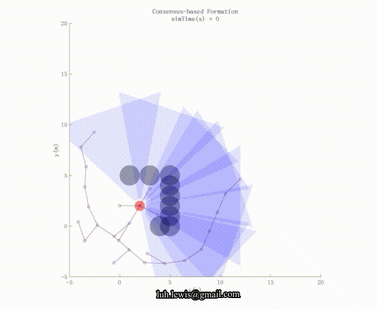
</div>


Then, how to recognize (when to trigger) the local dead-end becomes a problem, which lead us to local map learning.

### MATLAB Deep Learning Toolbox

MATLAB deep learning toolbox contains many pre-trained models like GoogLeNet, VGG-19, ResNet-101, etc. In this work, we design a relatively shallow 13-layer network for extracting features from the local map using MATLAB **deep network designer**. Following layers are demonstrated in MATLAB fashion.

```matlab
layers = [
    imageInputLayer([200 200 1],"Name","imageinput")
    convolution2dLayer([3 3],32,"Name","conv_1","Padding",[1 1 1 1],"Stride",[2 2])
    reluLayer("Name","relu_1")
    maxPooling2dLayer([5 5],"Name","maxpool_1","Padding","same")
    batchNormalizationLayer("Name","batchnorm_1")
    convolution2dLayer([3 3],64,"Name","conv_2","Padding",[1 1 1 1],"Stride",[2 2])
    reluLayer("Name","relu_2")
    maxPooling2dLayer([5 5],"Name","maxpool_2","Padding","same")
    batchNormalizationLayer("Name","batchnorm_2")
    fullyConnectedLayer(512,"Name","fc_1")
    fullyConnectedLayer(2,"Name","fc_2")
    softmaxLayer("Name","softmax")
    classificationLayer("Name","classoutput")];
```

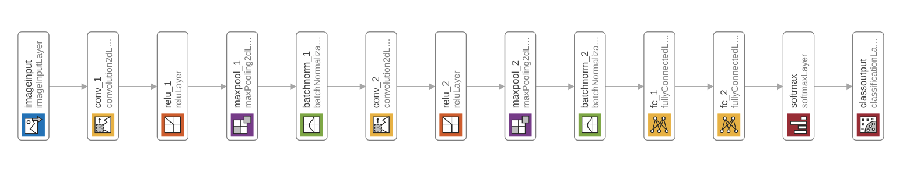

This network deals with local cost map, to address local-minimum problem during the navigation of the robot. Using vehicle-ego local cost map, a convolution encoder is adopted for representing the local map in the latent space for training. 

<div style="text-align:center">
    
    <p>
        If agent heading from left to right, (a) has local-minimum, (b) will not trap the agent. 
    </p>
</div>

In MATLAB, the training data is organized using build-in **imageDatastore**. It means the dataset should be organized in one folder for loading, separated by folder labels. In this task, data are separated into 2 labels as 1 -- local minimize, 0 -- free area. Synthetic data are in the folder 'labeledDataset'.

Create a data set (srcFilePath is pre-defined):

```MATLAB
digitDatasetPath = fullfile(srcFilePath, 'labeledDataset');
imds = imageDatastore(digitDatasetPath, ...
    'IncludeSubfolders',true, ...
    'LabelSource','foldernames');
```

Training process is shown below. 

<div>
    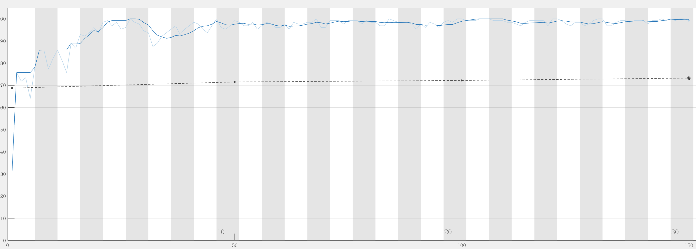
	<p style="text-align:center;">
    	Learning accuracy over iterations
    </p>
</div>

<div>
    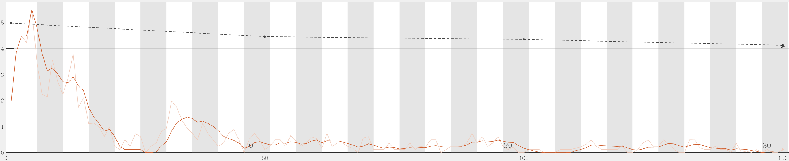
	<p style="text-align:center;">
    	Loss over iterations
    </p>
</div>


## Slices

<div>
    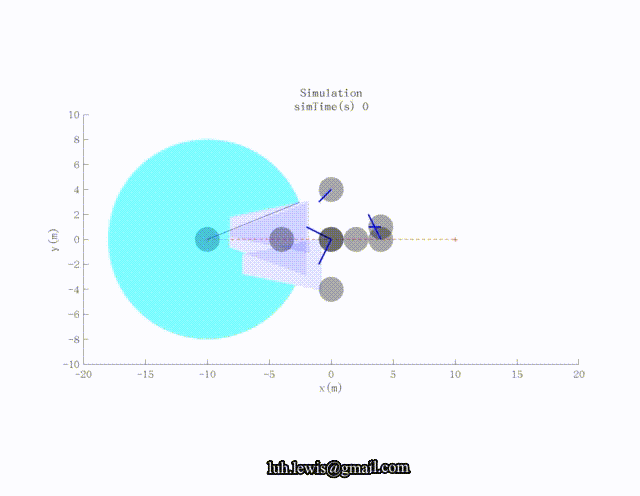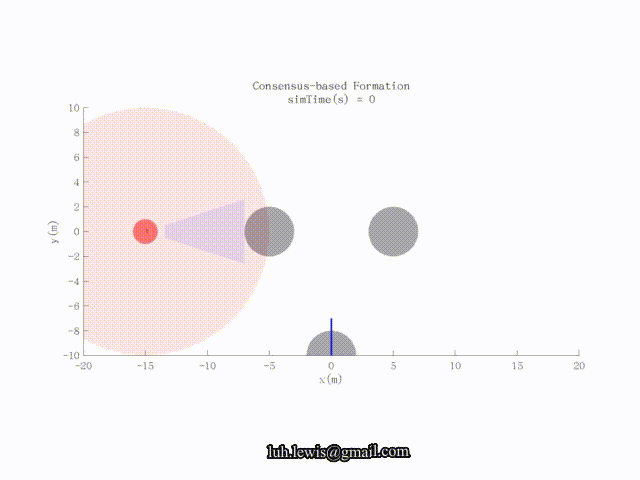
    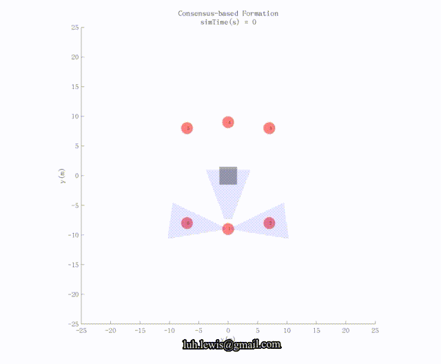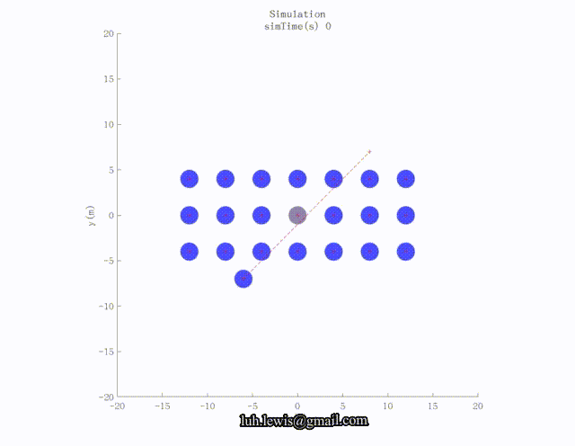
    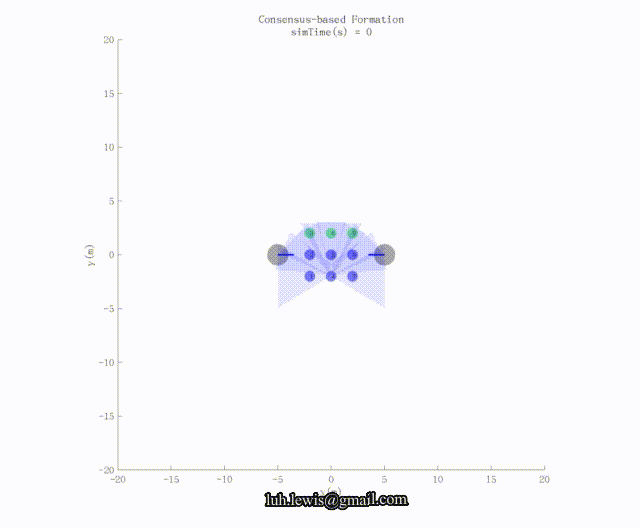  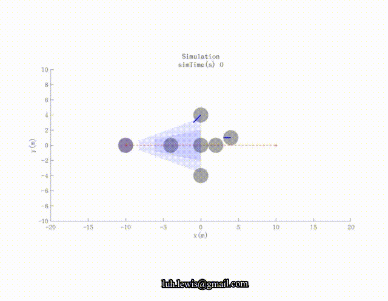 
</div>


## License

BSD-2

## Reference

[1]: Paolo Fiorini and Zvi Shiller. Motion planning in dynamic environments using velocity obstacles. The International Journal of Robotics Research, 17(7):760–772, 1998.

[2]: S. Zhao*, D. V. Dimarogonas, Z. Sun, and D. Bauso, "A general approach to coordination control of mobile agents with motion constraints" *IEEE Transactions on Automatic Control*, vol. 63, no. 5, pp. 1509-1516, 2018. 

