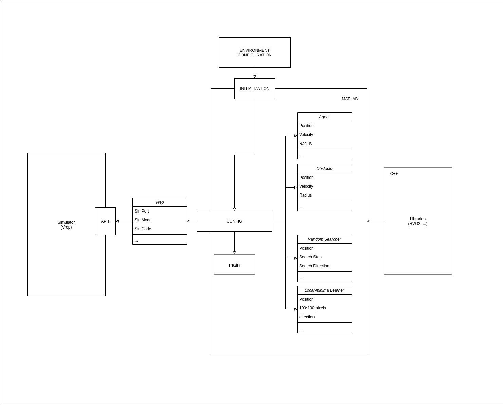

# README

This framework supports multi-agent simulation in MATLAB using object-oriented fashion. This framework is now under conversion to C/C++ implementation for higher performance. Currently, agent adopts the basic collision avoidance maneuvers and cooperative algorithms. The framework also implements a CoppeliaSim remote API wrapper for simulation using physical engine.

Author:  [Lu, Hong](http://www.lewissoft.com)

For questions regarding the project, drop me by email at: luhong@westlake.edu or luh.lewis@gmail.com.
## Table of Contents

- [Structure](#structure)
  - [Map Initialization](#Map Initialization)
  - [Outlier APIs wrapper](#Outlier APIs wrapper)
  - [Agent](#Agent)
  - [Obstacle](#Obstacle)
  - [Random Searcher](#Random Searcher)
- Maintainers
- License

## Structure

### Map Initialization

### Outlier APIs wrapper

### Agent

### Obstacle

### Random Searcher

## TO-DO Log

## Reference

