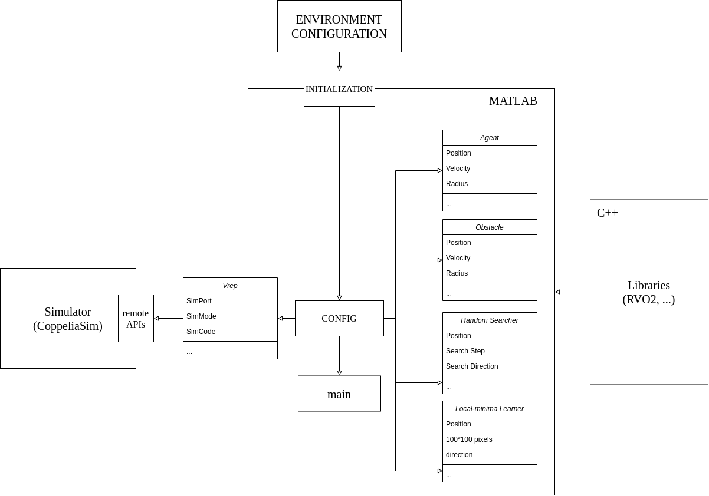
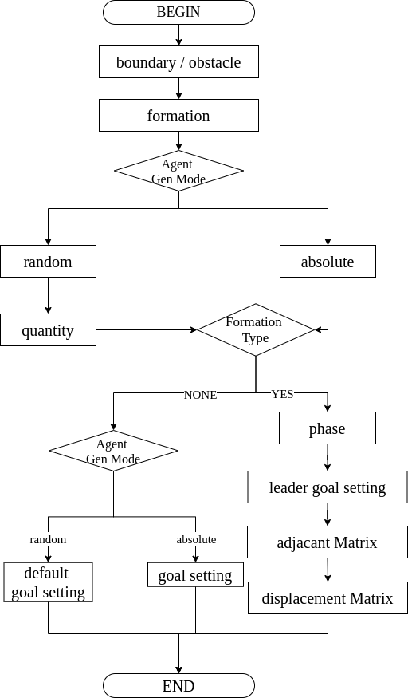
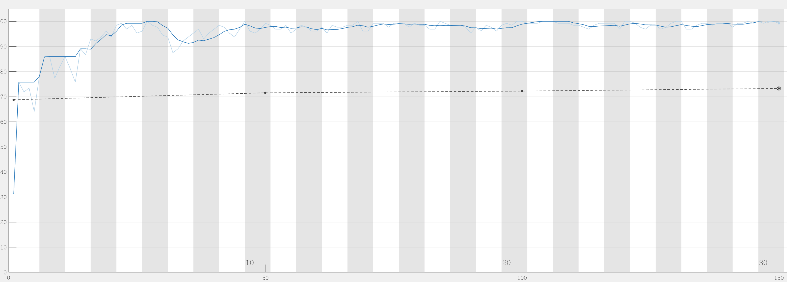
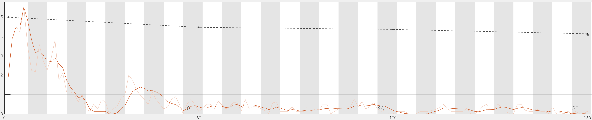
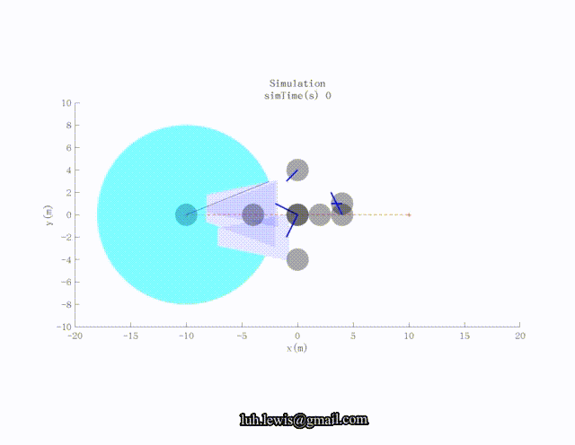
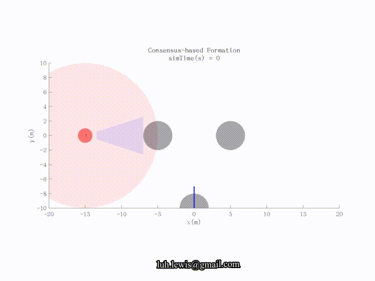
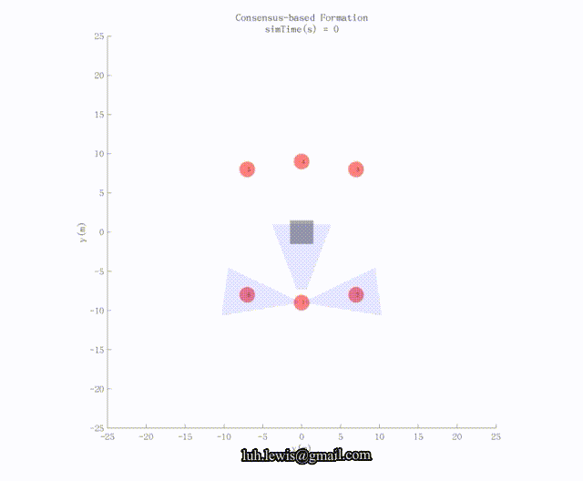
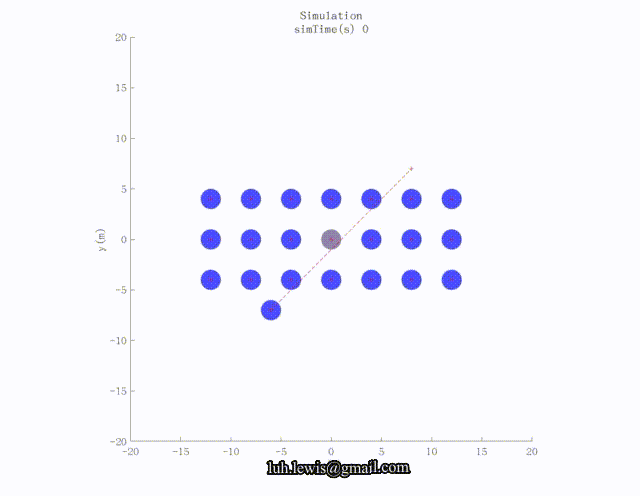
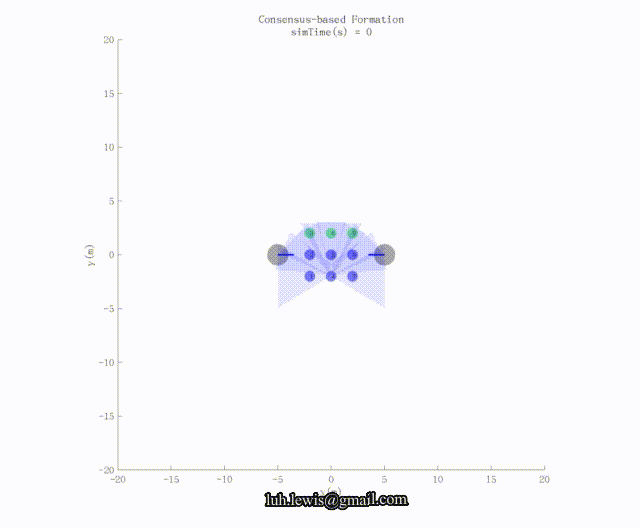

# README

This framework supports multi-agent simulation in MATLAB using object-oriented fashion. This framework is now under conversion to C/C++ implementation for higher performance. Currently, agent adopts the basic collision avoidance maneuvers and cooperative algorithms. The framework also implements a CoppeliaSim remote API wrapper for simulation using physical engine.

Author:  [Lu, Hong](http://www.lewissoft.com)

For questions regarding the project, drop me lines by email at: luhong@westlake.edu or luh.lewis@gmail.com.


## Table of Contents

- [Structure](#structure)
  - [Map Initialization](#Map-Initialization)
  - [Outlier APIs wrapper](#Outlier-APIs-wrapper)
- [Class](#class)
  - [Agent](#Agent)
  - [Obstacle](#Obstacle)
  - [Random Searcher](#Random-Searcher)
  - [Vrep](#Vrep)
- [Slices](#Slices)
- [License](#license)
- [Reference](#reference)


## Sim Structure

<div align="center">
    
    <p>
        General structure of the simulator
    </p>
</div>


- Vertically, the simulator configuration is initialized by maps outside according to certain predefined regulation. Map initialization has been shown in [Map Initialization](#map-initialization).
- Horizontally, the framework has various types of plug-in usages through MATLAB tools. Framework can use .MEX files to load RVO2 library for some certain purposes. CoppeliaSim Simulator remote-API has also been wrapped.

### Map Initialization

<div align=center>
    
    <p>Map initialization process in "util/loadMap.m"</p>
</div>

There are several self-defined keywords for map configuration:

* boundary
* deltaT
* formation
  * none
  * displacement
    * displacementMatrix
  * **ADDABLE** (e.g. position, distance)
* mode
  * absolute
  * random
    * quantity
* agent
* goal
* phase
* adjacantMatrix

All these keywords are parsing in "util/loadMap.m" and are members in **CONFIG** structure for simulation in MATLAB.

### Example

See "maps/example_absolute.txt", "maps/example_absolute_formation.txt", "maps/example_random.txt"

### Outlier APIs wrapper (Horizontal extension)

#### RVO2 Library

MEX is implemented for using RVO2 library written by [UNC](gamma.cs.unc.edu/RVO2/), detailed description is illustrated in *"doc/mex.pdf"* and *"doc/MATLAB_Cplusplus.md"*. Code is at *"RVO2/rvoGen"* folder which includes MEX generation script and CPP file for using RVO2 lib through MEX interface.

<div style="text-align:center">
    
    <p>
        Circle senario using RVO2 C++ LIB through MEX, shown in MATLAB
    </p>
</div>

To use RVO2 library, you should figure out the parameters' meanings. 

For example,

```C
sim->setAgentDefaults(f,i,f,f,f,f);
```

regulates the agent's behavior like maximum numbers of neighbors and maximum velocity, etc. which can been seen in **RVO2** **documents**.

#### CoppeliaSim (V-rep) simulator

CoppeliaSim remote API is used in *"@Vrep"* folder. It is a custom wrapper for our simulation of differential drive robot. Current functions can be seen in [here](#Vrep).

<div>
    <video src="video/noObsVrep.mp4">
    </video>
</div>

<div>
    <video src="video/threeObsVrep.mp4"></video>
	<p style="text-align:center">
        Simulation of [2] in CoppeliaSim
    </p>
</div>


## Class Document

### Agent

* Public
  * calNN
  * calOptVel
  * calVO
  * isReachGoal
* Private (helper functions)
  * helperBuildSearchTree
  * helperCalCollisionCone
  * helperCalVelocityObstacle
  * helperCalVelocityMap
  * helperCalPrefVelocity
  * helperCalDeadlockVelocity

### Obstacle

* updateState
* show

### Random Searcher

* Public
  * search
* Private (helper functions)
  * helperAddNewNode
  * helperIsNodeegal

### Vrep

* loadModel
* copyAndPasteCylinderHandle
* setObjectPosition
* getObjectPosition
* getLeftMotorHandle
* getRightMotorHandle
* getObjectOrientation
* setObjectOrientation
* setJointVelocity
* removeModel
* finish

## Local Map Learning

This framework also deals with local cost map to address local-minimum problem during the navigation of the robot. Using vehicle-ego local cost map, a convolution encoder is adopted for representing the local map in the latent space for training. 

<div>
    
	<p style="text-align:center;">
    	Learning accuracy over iterations
    </p>
</div>

<div>
    
	<p style="text-align:center;">
    	Lost value over iterations
    </p>
</div>

## Slices

<div>
    
    
    
</div>
## License

BSD-2

## Reference

[1]: Paolo Fiorini and Zvi Shiller. Motion planning in dynamic environments using velocity obstacles. The International Journal of Robotics Research, 17(7):760–772, 1998.

[2]:   S. Zhao*, D. V. Dimarogonas, Z. Sun, and D. Bauso, "A general approach to coordination control of mobile agents with motion constraints" *IEEE Transactions on Automatic Control*, vol. 63, no. 5, pp. 1509-1516, 2018. 

